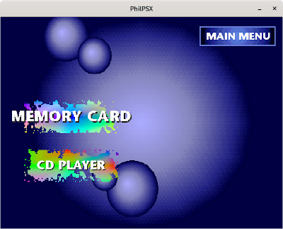

# PhilPSX

This is a PlayStation 1 emulator that I originally wrote in Java as a final-year university project, ending in August 2016. I decided to port the code to C afterwards and see how far I could take it in terms of functionality. The original Java version had a reasonably functional graphical debugger, and the aim is to implement the same in this version. The code has gathered dust on my machine for some time since 2018, but I've decided to start working on it again. Although at present it is very limited, I can't tell you the joy I felt when I first got a commercial PS1 BIOS to boot with PhilPSX after all the late nights of coding :smiley:. I would hate for this work to go to waste, and I have a great deal of nostalgia for the PS1 era, so I want to finish what I started (or at least bring it further).

As I originally used Netbeans to write both the Java version and the C port, there is no build system included at present. I am currently in the process of researching this, with a view to using either CMake or Meson. Currently, the emulator can fully boot a PSX BIOS, and the only game I tested it with was Crash Bandicoot thus far - this is the game I used during development, as it doesn't use the MDEC for FMV at all, so I was able to get it to boot to the title screen and run demos etc.

The code uses SDL at present and is launch from the command line - long term, my goal is to have a full graphical GTK application, possibly as a flatpak as well. I also want to make a dent in the below list of missing features - commercial BIOS requirement is a pain, and indeed to do this legally as part of my university project I had to obtain the hardware to physically dump a BIOS file from my PlayStation, and document this in my final report.

Please note that this is my own code, and there is no association or endorsement by Sony, implied or otherwise.

## Screenshots

 

## How to build

For now, due to lack of a build system, manual invocation of GCC is necessary. Make sure SDL2 and gperftools development packages are installed for your distro (Linux-only currently), then run:
``
gcc -g -pthread -lSDL2 -lprofiler -o PhilPSX `find . -name \*.c`
``

To execute the emulator, you must provide a flag for the BIOS image and a flag for the cue file of the CD image:
``
./PhilPSX -bios <bios file> -cd <cue file>
``

This will open an SDL window and dump debug output to the command prompt as well, as well as a gperftools dump file at the end.

## Implemented features

* Full interpretive MIPS R3051 CPU core, including Cop0 and Cop2 co-processors
* Full OpenGL implementation of the PS1 GPU
* Partial CD drive emulation

## Not yet implemented/stubbed out

* SPU (sound) support
* Controller support
* Audio streaming from CD drive and rest of CD commands
* Memory card support
* Graphical debugger
* Build system integration for easy building
* JIT recompiler CPU core for increased speed
* Open-source BIOS reimplementation to remove the need to use a commercial BIOS
* Loads of other stuff I've probably forgotten
